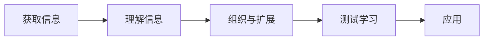

# 学习模型

## 前言

关于这个Mini-Report，预计花费30小时时间，在整式写下这份文档之前，我当然已经对学习有了一定的理解，在之后的记述中，这一理解被称为**零模型**。

零模型起源于《如何高效学习》一书，该零模型说明了学习是以下一系列过程：

在这五个阶段中，都必须遵守某些规则，才能达到高效学习的目的。与此同时，来自于建国的《学习观》这一系列视频，为我提供了一些基本的——像万有引力那样不可忽略——法则，它们分别是：

1. 刻意练习，使用例子重塑大脑链接
2. 分而治之
3. 学习不是记忆，知识不是信息

除此之外，还有一种处于逻辑之外的描述也很有趣。它分为四个阶段：

1. 你不知道你不知道

   在这个阶段你需要获取信息，获取经验，知道自己能知道什么，不知道什么

2. 你知道自己不知道

   在这个阶段，你知道自己不知道什么，因此可以在获取信息时更加有目标性

3. 你知道自己知道

   在这个阶段，你知道自己知道了什么，你也知道自己还有不知道的东西，你为知道和不知道之间划出了界限，因此可以正确地行动，应用自己能应用的知识，对自己做不到的事情保持尊重

4. 你不知道自己知道

   在这个阶段，你已经从心所欲，所做的一切都不会荒谬，你知道自己有不知道的东西，但你知道怎样去知道它，并且知道自己在知道不知道的过程中，会有哪些陷阱。总而言之，到了这一步，你已经很难犯错了，正因此称为从心所欲。

在本Mini-Report中，我将尝试阅读一些新的材料，用以加深我对于学习模型的进一步认知。我将反思自己在学习中的现象，并尝试为自己提出更好的策略。使用的材料在附录中展示。

### 写作本文的目的

当我决定学习数据结构的时候，我持有这样的观点——我具有良好的学习能力。然而，什么是良好的学习能力？事实是否如此？

而且很显而易见的是，我经常无法检测自己的学习成果，于是问题应运而生，我该如何测量自己的学习效果。从这一问题出发，我向自己提问，怎样才能高效学习？

## Chapter I 概要记录

我打算将本Mini-Report和Report：数据结构课程结合起来，作为我学习以及学习学习的案例。

我会在这一章节中记录我设计的学习的方法。

## Chapter II 基本学习模型

## Chapter III 超越性学习前言

假如我们将学习分为两类，第一类学习是单调性学习，其特征是增加或扩展个人知识库，但是并不会对先前的知识产生影响或修正；第二类学习是深层学习，其特征是会导致修正先前的知识。如果我们用更具吸引力的话语来形容第二种学习，我们可以说，深层学习超越了既有经验的束缚，是认知加工过程全新的行动方式，从而带来颠覆性的新范式解释已有的经验。一言以蔽之，击穿成见，豁然开朗。

## Chapter IV 超越性学习概述

季节会变化，但如果我们意识到春去秋来是一种周期性变化，那么这种变化也是不变的。同理可得，世界虽然是变化的，但自然法则是永恒不变的。持有这一观点的传统西方思想于是认为世界的表象是一个万花筒，夜空中的星象是基于普适的常量和不变的运动规律的万花筒，钟摆、抛物体、轮滑是机械运动规律的万花筒，物质材料的观测属性是原子和分子组成结构的万花筒。借助这种观点，自然科学取得了惊人的成功。

但这种不变是真实还是幻象？也许，对于十七十八世纪的欧洲科学家而言，这是毋庸置疑的信仰，但面对现代科学前沿所观测到的现象，需要重新打上一个问号。

## Appendix

{1}"深层学习".[美]斯特兰-奥尔松（Stellan Ohlsson).978-7-111-56093-7.认知心理学

{2}"如何高效学习".

{3}"A Social History of Truth"